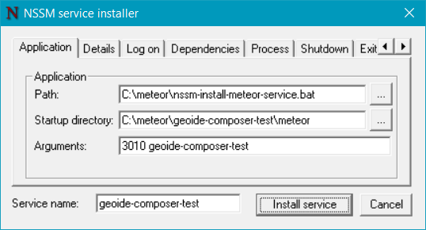
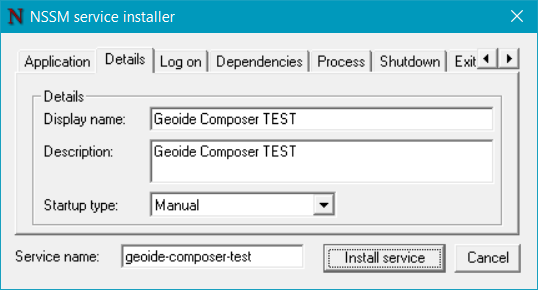
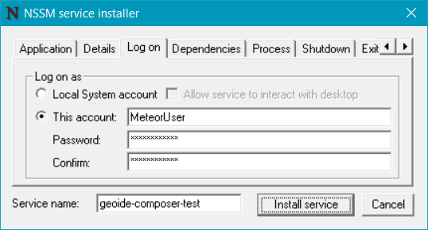
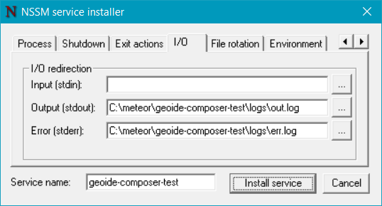

# Geoide Composer

Geoide Composer is gebouwd met meteorjs (Zie [Meteor](https://www.meteor.com/)).   

## Installatie
### Instructie voor inrichten Windows machine voor Geoide Composer 
De ingelogde gebruiker dient administratie rechten te hebben.   
In deze instructie wordt schijf C:\ als voorbeeld genomen om Geoide Composer in te installeren.   
U kunt hier desgewenst een andere schijf gebruiken.   
Voor het openen en uitpakken van zip bestanden wordt het programma [7-zip](http://www.7-zip.org/) aangeraden.
 
#### Installatieset van Geoide Composer (initieel)
Er moeten 3 zip bestanden worden gedownload.   
- [database](https://github.com/IDgis/mongodb/releases)   
``mongodb-[versieNr].zip`` MongoDB configuratie, data lokatie en scripts
- [configuratie](https://github.com/IDgis/geoide-admin-deployment/releases):   ``geoide-admin-deployment-[versieNr].zip**`` Geoide Composer configuratie, data en scripts      
- [programmatuur](https://github.com/IDgis/geoide-admin/releases):  
``geoide-admin-[versieNr].zip**`` Geoide Composer programmatuur   
Download bij de opgegeven versie van de release, de zip bestanden onder:   
  **Downloads** 
       *Source code (zip)*    

\*\* De naam de van de zip is die van de het github project *geoide-admin*, de naam van het product is *Geoide Composer*.

#### Installeren basis programma's   
Meteor en Mongo worden eenmalig geinstalleerd voor alle instanties van Geoide Composer. 
#####  * Meteor - develop/runtime omgeving  
  [Meteor Installatie](https://www.meteor.com/install), volg de instructies voor Windows.  
  Wordt lokaal geinstalleerd voor de ingelogde gebruiker:  
  ``C:\Users\USER\AppData\Local\.meteor\``   
  Geoide Composer is gebouwd met meteor 1.4.  
   
#####  * mongoDB - NoSQL database systeem   
  [Mongo](https://www.mongodb.com/download-center#community)       
  Centrale Mongo applicatie waar alle meteor applicaties mee kunnen verbinden   
  Download msi versie 2.6.12 for Windows server R2 en volg de instructies:  
     
  Mongo wordt in een van de standaard Windows folders geinstalleerd C:\Program Files of C:\Program Files (x86)   
  

#### Voorbereiding
Voorbereiding voor het aanmaken van initieele folder structuur. 
 
   *MongoDB*   
   1. Kopieer de folder ``mongodb`` uit  ``mongo-[versieNr].zip`` naar een schijf.
      Het resultaat is dan bijvoorbeeld ``C:\mongodb\``   
   2. Maak een mongoDB service als volgt:   
    Open een terminal (DOS prompt) en ga naar C:\Program Files\MongoDB 2.6 Standard\bin\   
    Voer uit:   
    ``C:\Program Files\MongoDB 2.6 Standard\bin> mongod --config  C:\mongodb\config\mongo.config --install``   
    Als schijf D: is gekozen als installatie schijf voor de database bestanden :   
    ``C:\Program Files\MongoDB 2.6 Standard\bin> mongod --config  D:\mongodb\config\mongoSchijfD.config --install``   

   *Geoide Composer*   
   1. Kopieer de folder geoide-composer uit  ``geoide-admin-deployment-[versieNr].zip`` naar een schijf.
      Het resultaat is dan bijvoorbeeld ``C:\geoide-composer``   
      Hernoem deze folder als u meerdere instanties naast elkaar wilt gebruiken zoals: 
   
     C:\
     |
     |-- geoide-composer-test\
     |       \ ...
     |
     |-- geoide-composer-live\
     |       \ ...
     |

U kunt desgewenst ook alle instanties groeperen onder een hoofdfolder:   
   
     C:\geoide-composer
     |     \ -- geoide-composer-test\
     |            \ ...
     |     \ -- geoide-composer-live\
     |            \ ...
     |

#### Instructie voor initieel installeren van Geoide Composer
   Het is mogelijk om meerdere instanties van Geoide Composer naast elkaar te installeren.   
   Elke instantie van Geoide Composer krijgt dan een eigen subfolder in ``C:\meteor\``.   
   Hier wordt als voorbeeld instantie ``geoide-composer-test`` gebruikt.   

1. Ga naar de link die is opgegeven voor de laatste Geoide-Composer release
2. Open de programmatuur zip:  ``geoide-admin-[versieNr].zip``   
3. ga naar ``C:\meteor\``
   Maak een folder met de naam van de Geoide Composer, bijvoorbeeld:  ``C:\meteor\geoide-composer-test\``     
   Maak hierin de subfolders ``meteor\``, ``conf\`` en ``logs\``   
4. kopieer inhoud van zip (onder ``geoide-admin-[versieNr]``, dus niet deze foldernaam zelf) naar ``C:\meteor\geoide-composer-test\meteor\``   
5. Open de configuratie zip:  ``geoide-admin-deployment-[versieNr].zip``   
6. Kopieer conf/settings.json naar ``C:\meteor\geoide-composer-test\conf\settings.json``   
   Pas de configuratie aan (zie Paragraaf Configuratie).  
   

#### Folder structuur na voorbereiding en installatie
  *Geoide-Composer*  
  De geoide-composer applicatie    

    C:\meteor\
     |   nssm-install-meteor-service.bat
     |
     |-- geoide-composer-test\
     |       \-- meteor\ 
     |          (inhoud van zip file)
     |       \-- logs\  
     |           out.log
     |           err.log
     |       \-- conf\
     |           settings.json
     |
     |-- geoide-composer-prod\
     |       \-- meteor\ 
     |  etc.      

  *MongoDB*  
  Beheer van gegevens van alle Geoide Composer instanties   
    
    C:\mongodb\
     | README
     |-- backup\                  # mogelijke lokatie voor backups
     |-- config\
     |     mongo.config           # Configuratie om MongoDB als service te starten
     |     mongoSchijfD.config    # idem als folderstructuur op schijf D is geplaatst
     |-- data\                    # centrale locatie voor alle databases van de mongo service
     |-- images\                  # plaatjes voor README
     |-- logs\                    # mongo log files
     |-- scripts\                 # backup en restore scripts
     |     mongo-backup.bat
     |     mongo-restore.bat

#### Geoide-Composer als service starten   
   Start ``C:\nssm-2.24\win64\nssm.exe install`` in een terminal en vul onderdelen in zoals in de voorbeelden hieronder:   
   In onderstaande is aangegeven wat in de diverse tabbladen van de nssm GUI kan worden ingevuld:
      
   
*Service name* ``geoide-composer-test``   
*Application\Path* De locatie van het nssm-install-meteor-service.bat script ``C:\meteor\nssm-install-meteor-service.bat``   
*Application\Startup directory* programmatuur ``C:\meteor\geoide-composer-test\meteor``   
*Application\Arguments* METEOR\_PORT  MONGO\_DB\_NAME    
  bijvoorbeeld ``3010 geoide-composer-test``    
  Zie ook _Meerdere instanties van Geoide Composer naast elkaar gebruiken_
      

*Details\Display name* ``Geoide Composer TEST``   
*Details\Description* naar believen in te vullen    
*Details\Startup type* ``Manual``     
      

*Login\Log on* Vul in de gebruiker die meteor en Geoide Composer heeft geinstalleerd, LocalSystem bijvoorbeeld werkt niet         
      

*IO\Output stdout* ``C:\meteor\geoide-composer-test\logs\out.log``    
*IO\Error stderr* ``C:\meteor\geoide-composer-test\logs\err.log``    
    
Om een bestaande service aan te passen:   
``C:\nssm-2.24\win64\nssm.exe edit <service name>``

#### Instructie voor update van Geoide Composer

1. Ga naar de link die is opgegeven voor de laatste Geoide-Composer release
2. Open de programmatuur zip:  ``geoide-admin-[versieNr].zip``   
3. stop de service ``geoide-composer-test``
4. ga naar ``C:\meteor\geoide-composer-test\meteor``
5. delete alles in deze folder
6. kopieer inhoud van zip (onder ``geoide-admin-[versieNr]``, dus niet deze foldernaam zelf) naar ``C:\meteor\geoide-composer-test\meteor``   
7. start de service ``geoide-composer-test`` 
8. NB 1: Het opstarten kan lang duren omdat meteor eerst de applicatie moet bouwen  
NB 2: applicatie logs zijn te vinden onder ``C:\meteor\geoide-composer-test\logs\``   
NB 3: configuratie moet in  ``C:\meteor\geoide-composer-test\conf\settings.json`` staan   
Aanpassingen hierin worden vanzelf door meteor verwerkt, er is geen restart van de service nodig.   
 
#### Verificatie   
  Kijk of de service onder de opgegeven naam is geinstalleerd (Windows beheer, services)   
  Start indien nodig de service en ga met een browser naar http://localhost:METEOR_PORT   
	
## Configuratie   
 De configuratie van de geoide-composer staat in het bestand ``C:\meteor\geoide-composer-test\\conf\settings.json``     
 Dit bestand heeft de volgende structuur:
 
    {
      "viewer": {
        "reloadConfigUrl": "http://httpbin.org/get"
      },
      "legendGraphic": {
        "uploadFolder": "/tmp/.uploads/"
      },
      "requestcache": {
        "delay" : 600000 
      }
    }

Dit bestand kan gewijzigd worden met een teksteditor zoals Windows kladblok of NotePad++.
De onderdelen:
  * reloadConfigUrl - dit is een url van de Geoide-Viewer   
    Geoide-Composer roept deze url aan telkens als er iets wordt opgeslagen.    
  * delay - het interval in milliseconden waarin cache wordt geleegd.  
   (alle requests naar externe services (WMS, WFS, TMS) worden gecached,     
   regelmatig worden deze caches leeggemaakt om tussentijdse veranderingen in services mee te kunnen nemen)   

## Meerdere instanties van Geoide Composer naast elkaar gebruiken.
Er kunnen meerdere instaties van Geoide Composer naast elkaar worden geinstalleerd en gebruikt.   
Het belangrijkste onderscheid zit in de foldernamen, databasenamen, servicenamen en de toegekende meteor poorten.   

### folders
Elke instantie van Geoide Composer is een kopie van de release zip naar een eigen folder.   
Voorbeelden:

       C:\meteor\                      
       |-- geoide-composer-test\         
       |                                 
       |-- geoide-composer-prod\         
       |                                 
       |  etc.                           
                                         
### services
Voor elke instantie van Geoide Composer wordt een eigen service gemaakt met nssm.

### databases
Elke instantie van Geoide Composer krijgt een eigen database toegewezen.   
Dit gebeurt bij het aanmaken van de service met nssm (tabblad Application\Arguments).   

### poorten
Elke instantie van Geoide Composer krijgt een eigen meteor poort nummer (nssm tabblad Application\Arguments).   
Voor deze poortnummers geldt het volgende:   
1. de standaard meteor poort is 3000.   
2. Intern gebruikt meteor ook poortnr+1, dus bijvoorbeeld 3001.   
Gebruik deze standaard poorten bij voorkeur niet, maar ga uit van de reeks 3010, 3020, 3030 etc.   

### url's
Het onderscheid tussen meteor applicaties zit in het poort nummer van de url.  
Dus bijvoorbeeld http://localhost:3010/ en http://localhost:3020/.   
Externe urls kunnen dan zijn http://www.MijnBedrijf.nl:3010/, http://www.MijnBedrijf.nl:3020/.  
Het gebruik van http://www.MijnBedrijf.nl/composer-test/ en http://www.MijnBedrijf.nl/composer-prod/   
blijkt tot problemen te kunnen leiden in de applicatie, in ieder geval bij gebruik van Windows IIS.   
  
## Backup en restore van Geoide Composer gegevens
1. Open de configuratie zip: ``geoide-admin-deployment-[versieNr].zip``   
2. Unzip uit folder scripts/ de bestanden ``mongo-backup.bat`` en ``mongo-restore.bat`` naar een folder die in het Windows PATH staat.
3. Voorbeeld voor gebruik:  
``mongo-backup.bat C:\backup\geoide-composer geoide-composer-test``  
``mongo-restore.bat C:\backup\geoide-composer\geoide-composer-test geoide-composer-test ``  
NB: Let op dat dezelfde gebruiker de backup en restore uitvoert.   

### Installeren initieele dataset voor CRS in Geoide Composer 
1. Voer het restore script uit:    
``mongo-restore.bat C:\MongoDB\data\dump\geoide-admin-test_crs2 [database naam]``

### Backup
Om de gegevens van Geoide-Composer te backuppen:  
1. stop de service ``geoide-composer-test``  
2. voer het script ``mongo-backup`` uit voor de betreffende database   
   ``mongo-backup.bat [folder voor database backup] [database naam]``  
   Voorbeeld:   
   ``mongo-backup.bat C:\backup\geoide-composer geoide-composer-test``  
4. start de service ``geoide-composer-test``  

### Restore
Om de gegevens van Geoide-Composer te herstellen:  
1. stop de service ``geoide-composer-test``  
2. voer het script ``mongo-restore`` uit voor de betreffende database  
   ``mongo-restore.bat [folder van database backup] [database naam]``  
   Voorbeeld:   
   ``mongo-restore.bat C:\backup\geoide-composer\geoide-composer-test geoide-composer-test ``  
3. start de service ``geoide-composer-test``  

NB: bij restore wordt de bestaande database overschreven met de gegevens uit de restore folder.  

   
