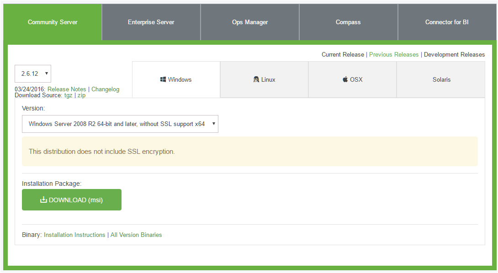

# Geoide Composer

Geoide Composer is gebouwd met meteorjs (Zie [Meteor](https://www.meteor.com/)).   

## Installatie
### Instructie voor inrichten Windows machine voor Geoide Composer 
De ingelogde gebruiker dient administratie rechten te hebben.   
In deze instructie wordt schijf C:\ als voorbeeld genomen om Geoide Composer in te installeren.   
U kunt hier desgewenst een andere schijf gebruiken.   
Voor het openen en uitpakken van zip bestanden wordt het programma [7-zip](http://www.7-zip.org/) aangeraden.
 
#### Installatieset van Geoide Composer (initieel)
Er moeten 3 zip bestanden worden gedownload.   
- [database](https://github.com/IDgis/mongodb/releases)   
``mongodb-[versieNr].zip`` MongoDB configuratie, data lokatie en scripts
Deze wordt eenmalig gebruikt voor de initeele MongoDB data structuur.
- [configuratie](https://github.com/IDgis/geoide-admin-deployment/releases):   ``geoide-admin-deployment-[versieNr].zip**`` Geoide Composer configuratie, data en scripts      
Deze wordt gebruikt bij de installatie van elke nieuwe Geoide Composer instantie.
- [programmatuur](https://github.com/IDgis/geoide-admin/releases):  
``geoide-admin-[versieNr].zip**`` Geoide Composer programmatuur   
Deze wordt gebruikt bij het installeren van een nieuwe release van Geoide Composer 

Download bij de opgegeven versie van de release, de zip bestanden onder:   
  **Downloads** 
       *Source code (zip)*    

\*\* De naam de van de zip is die van de het github project *geoide-admin*, de naam van het product is *Geoide Composer*.

#### Installeren basis programma's   
Meteor en Mongo worden eenmalig geinstalleerd voor alle instanties van Geoide Composer. 
#####  * Meteor - develop/runtime omgeving  
  [Meteor Installatie](https://www.meteor.com/install), volg de instructies voor Windows.  
  Wordt lokaal geinstalleerd voor de ingelogde gebruiker:  
  ``C:\Users\USER\AppData\Local\.meteor\``   
  Geoide Composer is gebouwd met meteor 1.4.  
   
#####  * mongoDB - NoSQL database systeem   
  [Mongo](https://www.mongodb.com/download-center#community)       
  Centrale Mongo applicatie waar alle meteor applicaties mee kunnen verbinden   
  Download msi versie 2.6.12 for Windows server R2 en volg de instructies:  
     
  Mongo wordt in een van de standaard Windows folders geinstalleerd C:\Program Files of C:\Program Files (x86)   
  
  Aanmaken van folder structuur en starten van MongoDB service.   
   1. Kopieer de folder ``mongodb`` uit  ``mongo-[versieNr].zip`` naar een schijf.
      Het resultaat is dan bijvoorbeeld ``C:\mongodb\``   
   2. Maak een mongoDB service als volgt:   
    Open een terminal (DOS prompt) en ga naar C:\Program Files\MongoDB 2.6 Standard\bin\   
    Voer uit:   
    ``C:\Program Files\MongoDB 2.6 Standard\bin> mongod --config  C:\mongodb\config\mongo.config --install``   
    Als schijf D: is gekozen als installatie schijf voor de database bestanden :   
    ``C:\Program Files\MongoDB 2.6 Standard\bin> mongod --config  D:\mongodb\config\mongoSchijfD.config --install``   

#### Voorbereiding Geoide Composer
 
   *Geoide Composer*   
   1. Kopieer de folder geoide-composer uit  ``geoide-admin-deployment-[versieNr].zip`` naar een schijf.
      Het resultaat is dan bijvoorbeeld ``C:\geoide-composer``   
      Hernoem deze folder als u meerdere instanties naast elkaar wilt gebruiken en kopieer de folder vervolgens nogmaals naar dezelfde schijf en hernoem: 
      
     C:\
     |
     |-- geoide-composer-test\
     |       \ ...
     |
     |-- geoide-composer-live\
     |       \ ...
     |

U kunt desgewenst ook alle instanties groeperen onder een hoofdfolder:   
   
     C:\geoide-composer
     |     \ -- geoide-composer-test\
     |            \ ...
     |     \ -- geoide-composer-live\
     |            \ ...
     |
In de volgende voorbeelden wordt aangenomen dat de installatie in ``C:\geoide-composer-test\`` heeft plaatsgevonden.

#### Installeren van Geoide Composer
1. Open de programmatuur zip:  ``geoide-admin-[versieNr].zip``   
2. ga naar ``C:\geoide-composer-test\``
3. kopieer inhoud van zip (onder ``geoide-admin-[versieNr]``, dus niet deze foldernaam zelf) naar ``C:\geoide-composer-test\meteor\``   
4. Pas de configuratie aan (zie Paragraaf Configuratie).  

#### Folder structuur na voorbereiding en installatie
  *Geoide-Composer*  
  De geoide-composer applicatie    

     C:\geoide-composer-test\
     |    \-- conf\
     |        settings.json # configuratie van het meteor programma
     |    \-- data\         # data voor een initiele vulling van de database
     |    \-- logs\         # logging van het meteor programma
     |        out.log
     |        err.log
     |    \-- meteor\       # meteor programma
     |       (inhoud van folder geoide-admin-[versieNr] uit zip file)
     |    \-- nssm\         # scripts voor het maken en starten van het meteor programma als Windows service  
     |
     |

  *MongoDB*  
  Beheer van gegevens van alle Geoide Composer instanties   
    
    C:\mongodb\
     | README
     |-- backup\                  # mogelijke lokatie voor backups
     |-- config\
     |     mongo.config           # Configuratie om MongoDB als service te starten
     |     mongoSchijfD.config    # idem als folderstructuur op schijf D is geplaatst
     |-- data\                    # centrale locatie voor alle databases van de mongo service
     |-- images\                  # plaatjes voor README
     |-- logs\                    # mongo log files
     |-- scripts\                 # backup en restore scripts
     |     mongo-backup.bat
     |     mongo-restore.bat

#### Geoide-Composer als service starten   
   Open een terminal (DOS prompt) en ga naar folder ``C:\geoide-composer-test\nssm\`` en 
   start batch bestand nssm-install-meteor-service.bat met de volgende parameters:   
   ``nssm-install-meteor-service.bat [lokatie meteor installaties] [meteor programma naam] [meteor poort]``
   Als het batch bestand klaar, is wordt de service gestart. Het opstarten kan lang duren omdat meteor eerst de applicatie moet bouwen
   
##### Toelichting:
Parameters:   
``[lokatie meteor installaties]`` hoofdlokatie van Geoide composer installaties bijv. ``C:``   
``[meteor programma naam]`` een subfolder van de hoofdlokatie bijv. ``geoide-composer-test``   
De service naam en database naam worden gelijk aan de programma naam   
``[meteor poort]``
Kies meteor poorten uit de reeks 3010, 3020, 3030 etc.   
Elk meteor programma moet een uniek poort nummer krijgen   
*Voorbeelden:*   
1. bij installatie op ``C:\geoide-composer-test\``
      ``nssm-install-meteor-service.bat  C:  geoide-composer-test  3010``   
   de service en database naam worden dan 'geoide-composer-test'   
2. bij installatie op ``C:\geoide-composer\live\``
      ``nssm-install-meteor-service.bat  C:\geoide-composer  live  3020``   
   de service en database naam worden dan 'live'   
    
Om een bestaande service aan te passen:   
``C:\geoide-composer-test\nssm\nssm-2.24\win64\nssm.exe edit <service name>``

#### Instructie voor update van Geoide Composer

1. stop de service bijv. ``geoide-composer-test``
2. ga naar ``C:\geoide-composer-test\meteor``
3. delete alles in deze folder
4. Open de programmatuur zip:  ``geoide-admin-[versieNr].zip``   
5. kopieer inhoud van zip (onder ``geoide-admin-[versieNr]``, dus niet deze foldernaam zelf) naar ``C:\geoide-composer-test\meteor``   
6. start de service ``geoide-composer-test`` 
NB: Het opstarten kan lang duren omdat meteor eerst de applicatie moet bouwen  
 
#### Configuratie   
 De configuratie van de geoide-composer staat in het bestand ``C:\geoide-composer-test\\conf\settings.json``     
 Dit bestand heeft de volgende structuur:
 
    {
      "viewer": {
        "reloadConfigUrl": "http://httpbin.org/get"
      },
      "legendGraphic": {
        "uploadFolder": "/tmp/.uploads/"
      },
      "requestcache": {
        "delay" : 600000 
      }
    }

Dit bestand kan gewijzigd worden met een teksteditor zoals Windows kladblok of NotePad++.
De onderdelen:
  * reloadConfigUrl - dit is een url van de Geoide Viewer   
    Geoide Composer roept deze url aan telkens als er iets wordt opgeslagen.    
    Hierdoor blijft de Viewer up-to-date bij wijzigingen met de Composer.   
NB. het bestand kan gewijzigd worden terwijl de service draait, wijzigingen worden vanzelf overgenomen.

## Verificatie   
  Kijk of de service onder de opgegeven naam is geinstalleerd (Windows beheer, services)   
  Start indien nodig de service en ga met een browser naar http://localhost:METEOR_PORT   
	
##### url's
Het onderscheid tussen meteor applicaties zit in het poort nummer van de url.  
Dus bijvoorbeeld http://localhost:3010/ en http://localhost:3020/.   
Externe urls kunnen dan zijn http://www.MijnBedrijf.nl:3010/, http://www.MijnBedrijf.nl:3020/.  
Het gebruik van http://www.MijnBedrijf.nl/composer-test/ en http://www.MijnBedrijf.nl/composer-live/   
blijkt tot problemen te kunnen leiden in de applicatie, in ieder geval bij gebruik van Windows IIS.   
  
## Backup en restore van Geoide Composer gegevens
Zie voor gebruik en toelichting het [mongodb](https://github.com/IDgis/mongodb/tree/master/mongodb/scripts) project in Github.

### Installeren initieele dataset voor CRS in Geoide Composer 
De database van Geoide composer kan voor gebruik worden gevuld. Er is data beschikbaar gemaakt voor CRS2 gebruikers.   
1. stop de service ``geoide-composer-test``
2. Voer het restore script uit van het [mongodb](https://github.com/IDgis/mongodb/tree/master/mongodb/scripts) project:    
``C:\mongodb\scripts\mongo-restore.bat C:\geoide-composer-test\data\geoide-admin-test_crs2 geoide-composer-test``   
Waarbij geoide-composer-test (de database naam) gelijk is aan de programma naam en de service naam.
3. start de service ``geoide-composer-test`` 

